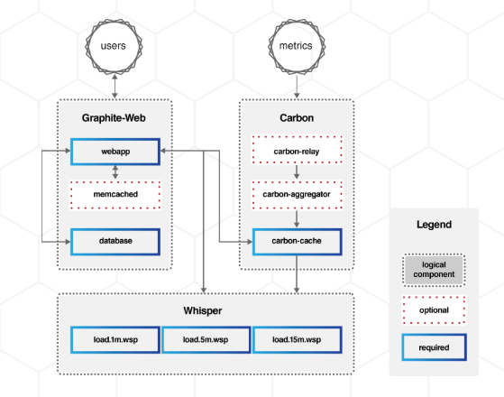

# Tổng quan về Graphite 

## Mục lục

[1. Giới thiệu](#overview)

[2. Kiến trúc](#arch)

[3. Một vài điều về Graphite](#something)

[4. Các thành phần](#tp)

<a name="overview"></a>
## 1. Giới thiệu
**Graphite** là một bộ công cụ giám sát giúp việc lưu trữ, truy xuất, chia sẻ và trực quan hóa time-series data trở nên dễ dàng hơn, có khả năng mở rộng cao.

Graphite ban đầu được thiết kế và viết bởi **Chris Davis** và **Orbitz** vào năm 2006 như một dự án phụ và đưuọc phát triển thành một công cụ giám sát nên tảng của họ. Đến năm 2008 **Orbitz** cho phép Graphite được phát hành dưới dạng mã nguồn mở ***Apache 2.0 license***. Vô số các công ty đã triển khai Graphite để giúp học giám sát việc các dịch vụ thương mai điện tử của họ như: Github, Reddit,...

Hai chức năng chính:

1. Lưu trữ dữ liệu theo thời gian (kiểu time-series data) 
2. Render đồ thị dữ liệu theo yêu cầu

Graphite không hề thu thập dữ liệu cho bạn, mà sẽ cần một công cụ khác thu thập rồi đẩy về cho nó để lưu trữ, ví dụ CollectD. Nhưng nó cung cấp một đường dẫn đơn giản để có thể đưa dữ liệu tính toán được và time-series database. 

Một ví dụ cho thấy việc đẩy dữ liệu của bạn vào Graphite không thể dễ dàng hơn:

	$ echo "foo.bar 1 `date +%s`" | nc localhost 2003

Với port `2003` là port đang được graphite mở ra đẻ nhận dữ liệu

Một số các tool của bên thứ 3 có thể kết hợp với Graphite để thực hiện thu thập dữ liệu như:

* Brubeck
* Bucky
* Carbonator Windows Service
* Collectd
* Collectl
* Diamond
* Ganglia
* graphite-pollers
* Graphite PowerShell Functions
* HoardD
* Host sFlow
* Logstash
* Sensu
* telegraf
* ...

Ngoài ra còn có rất nhiều tool khác [ở đây](https://graphite.readthedocs.io/en/latest/tools.html)

<a name="arch"></a>
## 2. Kiến trúc

Graphite có kiến trúc khá đơn giản với 3 thành phần chính:

1. **carbon** - là một daemon thực hiện lắng nghe dữ liệu kiểu time-series
2. **whisper** - là một thư viện database đơn giản để lưu trữ time-series data (thiết kế tương tự RRD)
3. **graphite webapp** - là một webapp django có thể render đồ thị theo yêu cầu sử dụng 



**Cung cấp dữ liệu của bạn một cách dễ dàng**, khi dữ liệu được gửi tới, carbon sẽ nhận dữ liệu đầu tiên, và chúng có thể ngay lập tức khả dụng và hiển thị trên graphite webapp. Webapp sẽ cung cấp một số cách để tạo và hiển thị biểu đồ bao gồm các URL API được rendering kèm theo, cho phép dễ dàng nhúng và các webpages khác.

Nền tảng Web của Graphite cũng cấp nhiều định dạng đầu ra như raw images, CSV, XML, and JSON, cho phép mọi người dễ dàng nhúng các biểu đồ đưuoc tùy chỉnh trong web pages khác hoặc dashboards.

<a name="something"></a>
## 3. Một vài điều về Graphite

### How scalable is Graphite?

Nhìn từ góc độ về CPU, Graphite có thể mở rộng về chiều ngang trên cả frontend và backend, nghĩa là bạn có thể dễ dàng thêm nhiều máy vào để tăng thêm thông lượng (throughput). Nó cũng tăng về khả năng chịu lỗi khi có một máy hỏng thì sẽ hạn chết tối đa lượng dữ liệu bị mất (bất cứ thứ gì được cached trong memory) và hệ thống sẽ không bị gián đoạn nếu dung lượng con lại đủ để xỷ lý tải.


Từ góc độ I/O, Graphite thực hiện rất nhiều các hoạt động I/O nhỏ trên nhiểu files khác nhau rất nhanh. Vì mỗi một metric khác nhau được gửi tới Graphite sẽ được lưu lại trong database file, tương tự như các tools như Cacti, Centreon,... được xây dựng dựa trên RRD.

High volume (có tới vài nghìn metrics khác nhau được update trong mỗi phút) sẽ yêu cầu về RAID và SSDs tốt. 

### Does Graphite use RRDtool?

Graphite không sử dụng RRD tool. Ngay từ khi mới được viết vào năm 2006, Graphite đã có một thư viện cơ sở dữ liệu riêng được gọi là ***whisper***, nó được thiết kế tương tự với RRD.


<a name="tp"></a>
## 4. Các thành phần của Graphite

### 4.1 Carbon

Carbon là backend lưu trữ cho cấu hình Gaphite. Một cấu hình Graphite đơn giản sẽ có một hoặc nhiều Cardbon daemon chịu trách nhiệm xử lý dữ liệu được gửi thông qua các tiến trình khác được thu thập và truyền số liệu thống kê (bộ thu thập không là thành phần của Graphite)

Có nhiều loại daemon Carbon, mỗi loại xử lý dữ liệu theo cách khác nhau. Cơ bản nhất trong số đó là carbon-cache.py. Daemon này lắng nghe dữ liệu trên một port và ghi dữ liệu vào đĩa khi nó đến một cách hiệu quả.

Nó lưu dữ liệu đến và đẩy vào đĩa sau một khoảng thời gian đã định trước. Điều quan trọng là thành phần Carbon xử lý các quy trình nhận và flush dữ liệu. Nó không xử lý các cơ chế lưu trữ thực tế.

Daemon `carbon-cache.py`cho biết các định dạng, giao thức và các cổng để nhận dữ liệu. Đồng thời cũng cho biết các chính sách để sử dụng lưu trữ dữ liệu. Những thứ này được đưa tới `whisper`. Với hầu hết cấu hình cơ bản, một `carbon-cache.py` là đủ để xử lý việc tiếp nhận dữ liệu.

Nhiều trường hợp có thể chạy cùng lúc khi thiết lập của bạn phát triển hơn. Có thể cân bằng tải bởi daemon `carbon-relay.py` hoặc `carbon-aggregator.py` ở phía trước.

Daemon `carbon-relay.py` có thể được sử dụng để gửi các request tới tất cả daemon backend để phòng bị. Nó cũng có thể được sử dụng để chia sẻ dữ liệu thông qua các carbon-cache.py khác để phân tải được được trên nhiều vị trí lưu trữ.

Daemon `carbon-aggrerator.py` có thể buffer dữ liệu rồi đẩy nó vào `carbon-cache.py` sau một khoảng thời gian. Điều này làm giảm tác động của quá trình xử lý số liệu thống kê trên hệ thống ở chi phí các chi tiết.

### 4.2 Whisper

**Whisper** là một thư viện cơ sở dữ liệu có kích thước cố định, được thiết kế tương tự với RRD. Cung cấp khả năng lưu trữ dữ liệu số nhanh và đáng tin cậy qua thời gian. Whisper có khả năng lưu trữ dữ liệu với độ phân giải cao như "seconds per point".

Một hệ thống lưu trữ chuyên dụng gọi là Round Robin Database cho phép lưu trữ một lượng lớn các thông tin theo thời gian như nhiệt độ, băng thông mạng và giá cổ phiếu và ghi dữ liệu vào đĩa liên tục. Nó thực hiện điều này bằng cách tận dụng các nhu cầu thay đổi cho độ chính xác.

Để tiết kiệm không gian, chúng ta có thể thu thập dữ liệu cũ bằng chức năng Hợp nhất (CF), thực hiện một số tính toán trên nhiều điểm dữ liệu để kết hợp nó vào một điểm duy nhất trong một khoảng thời gian dài hơn. Hãy tưởng tượng rằng chúng tôi lấy trung bình của 288 mẫu vào cuối mỗi 24 giờ; Trong trường hợp đó, chúng tôi chỉ cần 365 điểm dữ liệu để lưu trữ dữ liệu cho cả năm

**Data points** 

Data points trong Whisper được lưu trữ trên đĩa như big-endian double-precision floats. Mỗi giá trị sẽ có một timestamp tương ứng, timestamp này được tính bằng giây bắt đầu từ UNIX Epoch (01-01-1970). Gia trị dữ liệu sẽ được phân tích cú pháp bằng hàm `float()` của python, như vậy nó sẽ xử lý theo cùng một cách cho các chuỗi đặc biệt, ví dụ `inf`. Gia trị lớn nhất và giá trị nhỏ nhất được xác định trong phạm vi được trình thông dịch của python cho phép cho các gia trị float. Ta có thể kiểm tra bằng cách sau:

```sh
[root@trang-20-52 whisper]# python -c 'import sys; print sys.float_info'
sys.float_info(max=1.7976931348623157e+308, max_exp=1024, max_10_exp=308, min=2.2250738585072014e-308, min_exp=-1021, min_10_exp=-307, dig=15, mant_dig=53, epsilon=2.220446049250313e-16, radix=2, rounds=1)
```

**Archives: Retention and Precision**

Whisper databases bao gồm một hoặc nhiều Archives, mỗi một resolution (độ phân giải) và retention (thời gian giữ lại) của dữ liệu cụ thể. Archives sẽ được đặt hàng từ highest-resolution và shortest retention archive đến kho lưu trữ có lowest-resolution and longest retention.

> Note: resolution and retention định nghĩa số lượng các điêm dữ liệu hoặc độ tuổi tối đa của timestamp. 
> Ví dụ, `retentions = 120s:120d` tức là cứ 120s lấy một data point và lưu trữ các data point đó tối đa 120 ngày.


**Differences Between Whisper and RRD**

* RRD không thể update vào một time-slot ở trước thời điểm cập nhật gần đây nhất. Điều này có nghĩa là không có cách nào có thể chèn dữ liệu vào RRD series. Whisper thì không giới hạn điều này, nó khiến cho việc nhập dữ liệu vào Graphite đơn giản và dễ dàng hơn rất nhiều. 

* RRD không được thiết kế để nhận các dữ liệu bất thường. Trong nhiều trường hợp (tùy thuộc vào cấu hình) nếu một update được thực hiện cho một loạt các RRD nhưng lại không được theo dõi bởi một bản update khác thì bản update ban đầu sẽ bị xóa. Ví dụ, với metric A có mốc thời gian là 5:05:00 đến sau metric B có mốc thời gian là 5:05:30, thì metric đến trước đó sẽ hoàn toàn bị loại bỏ.

* Whisper yêu cầu các metric mới phải có cùng interval với kho lưu trữ có độ phân giải lớn nhất. 

* Whisper nhanh hơn trong hầu hết các mục đích của nó, chủ yếu là do Whisper được viết bằng python còn RRDtool thì được viết bằng C.

### 4.3 Graphite web

Graphite cung cấp một giao diện web linh hoạt để render đồ thị, với việc sử dụng các function được cung cấp sẵn kết hợp với nhiều loại thông số dữ liệu, kiểu chữ, màu sắc bạn có thể tùy chỉnh kích thước, interval và tạo ra nhiều đồ thị đa dạng.

Graphite render đồ thị dựa trên các data point nó nhận được và chuyển tới bạn. Nó không ngay lập tức in đồ thị ra và vứt dữ liệu đi. Bạn có thể render bất kì dữ liệu nào mà bạn muốn.

Ngoài ra bạn cũng có thể lưu lại các đồ thị render được với các thông số và layout, để monitor theo ý muốn.

Hơn thế nữa, Graphite cũng cung cấp cho bạn các URL API để nhúng vào các webpages khác, hoặc có thể xuất dữu liệu ra các định dạng khác như JSON hoặc CSV,...


## Tham khảo thêm

https://graphiteapp.org/#gettingStarted

https://graphite.readthedocs.io/en/latest/