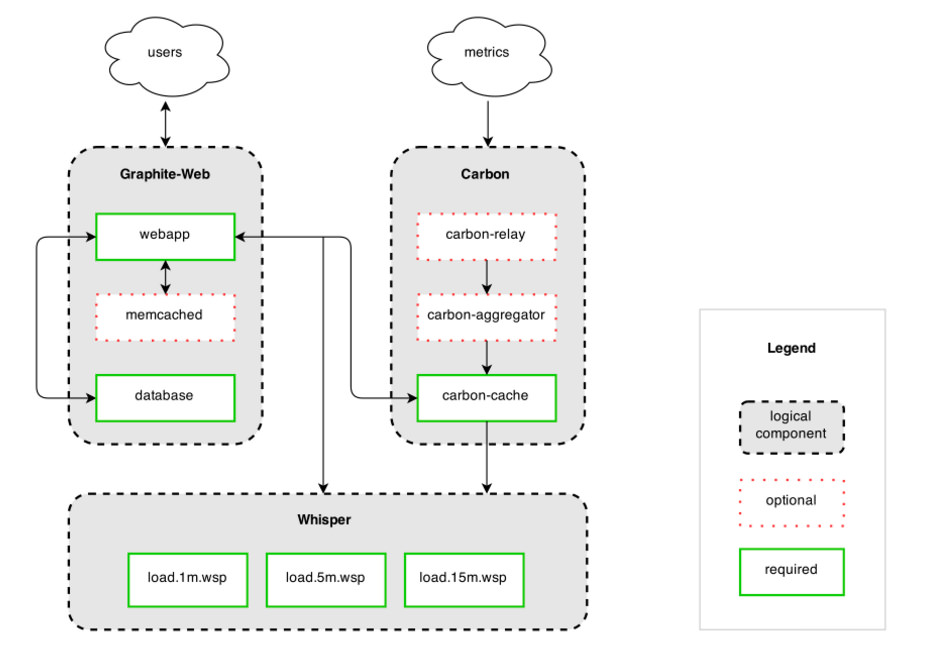

## Tìm hiểu về Carbon Daemon

Carbon là một thành phần của graphite, nhận các metric từ các client (sử dụng collectd,...), cache metric vào memory (RAM), trước khi đẩy xuống storage backend để lưu trữ, Graphite-web ngoài query từ storage backend còn có thể query trực tiếp trên lớp cache này.

Carbon gồm có 3 daemon chính là: carbon-cache, carbon-relay, carbon-aggregator.

Khi nói về `carbon` chúng ta thường hiểu là muốn nói đến một hoặc nhiều các daemon khác nhau để tạo nên storage backend của trình cài đặt graphite. Việc cài đặt đơn giản, thông thường, mặc định sẽ chỉ có một daemon chạy, là `carbon-cache.py`. Ngoài ra nếu muốn phát triển thêm, bạn có thể sử dụng thêm `carbon-relay.py`, `carbon-aggregator.py` daemon để phân tải các metric, thwucj hiện tùy chỉnh aggregations.

Tất cả các carbon deamon đều lắng nghe time-series data và có thể chấp nhận nó qua một [protocol](https://graphite.readthedocs.io/en/latest/feeding-carbon.html) được thiết lập chung. Tuy nhiên, với mỗi loại dữ liệu chúng sẽ có cách xử lý riêng.

### 1. carbon-cache.py

`carbon-cache.py` chấp nhận các metirc qua các giao thức khác nhau và ghi chúng vào đĩa một cách hiệu quả nhất có thể. Điều này đòi hỏi việc caching metric vào RAM  khi nhận được dữ liệu, và flushing chúng vào đĩa trong một khoảng thời gian (chu kỳ) sử dụng thư viện whisper ở bên dưới

Daemon carbon-cache là tiến trình làm việc chăm chỉ nhất được viết bằng python.

`carbon-cache.py` yêu cầu một số các cấu hình cơ bản để chạy:

* `carbon.conf`: Trong section [cache] cấu hình các ports (2003/2004/7002), giao thức (newline, delimited, pickle) và transports (TCP/UDP) để thực hiện lắng nghe.

* `storage-schemas.conf`: Định nghĩa các retention policy cho các metric đi vào dựa trên các regex pattens. Polycy này sẽ được passed tới whisper khi file `.wsp` được phân bổ trước và cho phép lưu trữ dữ liệu trong bao lâu.

Khi số lượng các metric tăng lên, một `carbon-cache.py` instance có thể sẽ không đủ để xử lý I/O load. Để mở rộng nó, đơn giản là chỉ cần chạy nhiều `carbon-cache.py` instance (trên một hoặc nhiều máy) ở phía sau carbon-aggregator.py hoặc carbon-relay.py.

### 2. carbon-relay.py

`carbon-relay.py` phục vụ cho hai mục đích riêng biệt là replication và sharding.

Khi chạy với `RELAY_METHOD = rules`, một `carbon-relay.py` instance có thể chạy cùng server với `carbon-cache.py` và làm chậm lại tất cả các metrics tới đến nhiều backend `carbon-cache.py` đang được chạy trên nhiều các ports hoặc hosts khác.

Trong chế độ `RELAY_METHOD = consistent-hashing`, cài đặt một `DESTINATIONS` để định nghĩa một chiến lược sharding để đẩy tới nhiểu carbon-cache. Danh sach băm đồng nhát có thể được cung cấp cho graphite-webapp qua `CARBONLINK_HOSTS` để trải rộng việc đọc trên nhiều backen. 

`carbon-relay` được cấu hình qua: 

* `carbon.conf`: section `[relay]` định nghĩa các host/post và một `RELAY_METHOD`

* `relay-rules.conf`: với `RELAY_METHOD = rules` được thiết lập, các bộ pattern/servers được định nghĩa trong file này, các metrics cần phải matchinh với các regex rules nhất định vào được forwarded tới host nào.

### 3. carbon-aggregator.py

`carbon-aggregator.py` có thể được chạy ở phía trước carbon-cache.py để buffer các metrics over time trước khi báo cáo chúng tới whisper. Điều này sẽ hữu ích khi việc báo cáo chi tiết là không cần thiết, và có thể giúp giảm tải I/O và whisper file sizes do retention policies thấp hơn.

`carbon-aggregator.py` được cấu hình qua.

* `carbon.conf`: section `[aggregator]` định nghĩa port/hosts lắng nghe và làm destination.

* `aggregation-rules.conf`: định nghĩa một time interval (in seconds) và aggregation function (sum or average) cho các metric đến phải matching với các pattern nhất định. Cuối mỗi interval, các giá trị nhật được sẽ được tổng hợp và đẩy tới `carbon-cache.py` như một metric đơn lẻ.

### 4. carbon-aggregator-cache.py

`carbon-aggregator-cache.py` là sự kết hợp cả hai carbon-aggregator.py và carbon-cache.py. Điều này hữu ích cho việc giảm tài nguyên và chi phí quản lý hơn so với việc chạy cả hai daemon riêng biệt.

`carbon-aggregator-cache.py` được cấu hình qua:

* `carbon.conf`: trong section `[aggregator-cache]` định nghĩa các port/host để làm người lắng nghe và làm đích đến.

* `relay-rules.conf`: Giống với phần cấu hình cho `carbon-relay.py` ở bên trên.

* `aggregation-rules.conf`: Giống với phần cấu hình cho `carbon-aggregator.py` ở bên trên.

