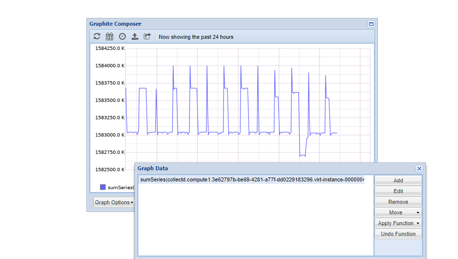
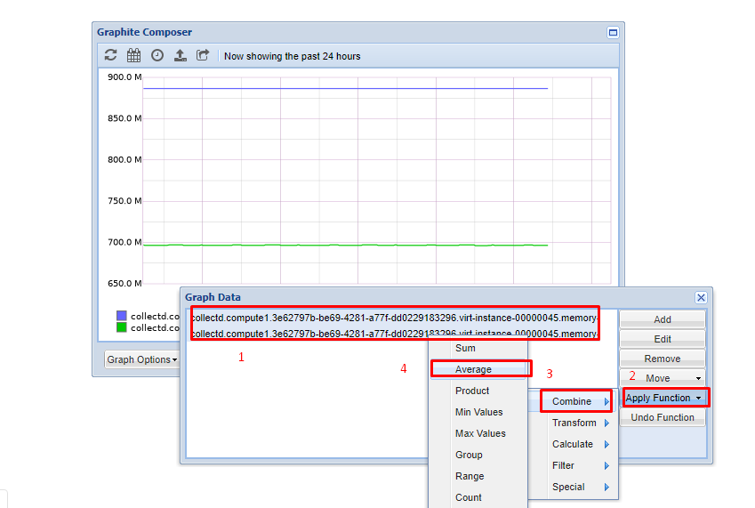
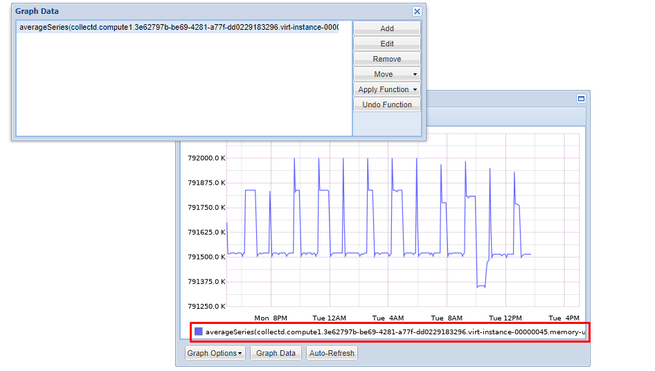
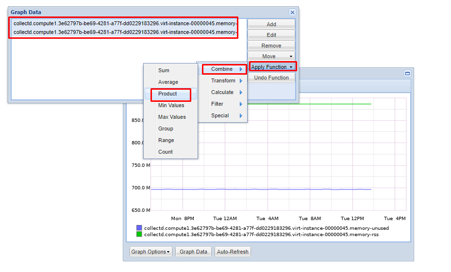
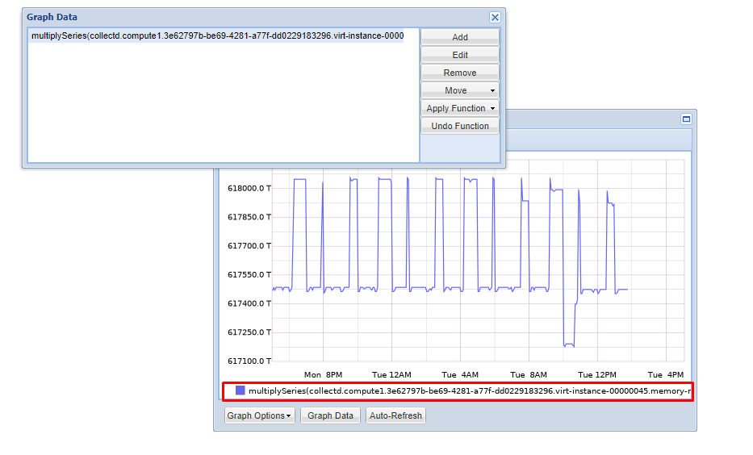
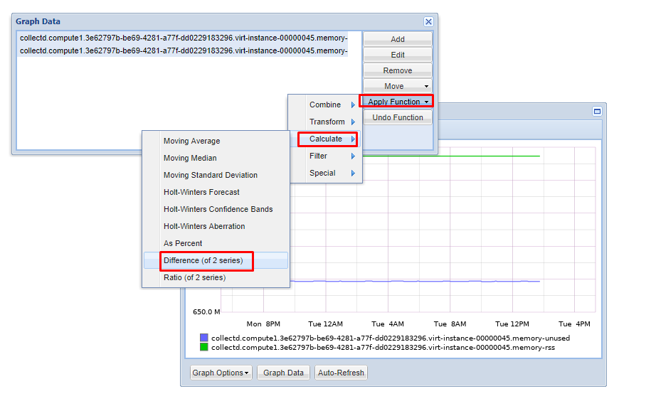
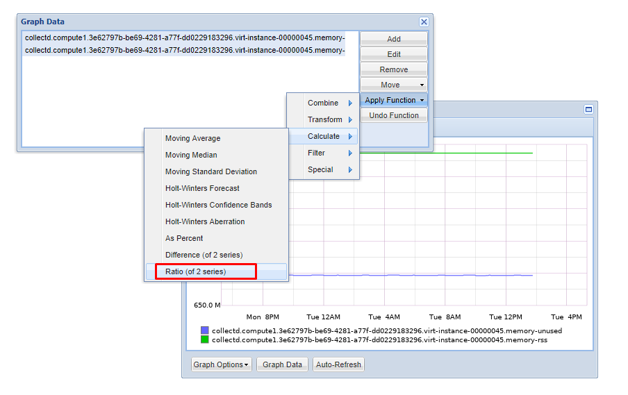

## Tìm hiểu một số Function được hỗ trợ bởi Graphite

[1. Sum Function](#sum)

[2. Average Function](#average)

[3. Product Function](#product)

[4. Min value Function](#min)

[5. Difference Function](#diff)

[6. Ratio Function](#ratio)

### 1. Sum Function

Hàm này dùng để tính tổng các metric tại mỗi data point của hai metric được chọn.

### 2. Average Function

Hàm tính trung bình cộng các metric được chọn

### 3. Product function

Hàm giúp nhân hai thông số với nhau

### 4. Min value function.

Hàm giúp tìm ra metric có giá trị nhở nhất

Tương tự với hàm `Max value function`

### 5.  Difference Function.

Hàm thực hiện so sánh hai thông số được chọn sau đó lấy metric thứ nhất trừ cho metric thứ hai. 

### 6. Ratio function.

Hàm tính tỉ lệ giữ hai metric đang được chọn.

